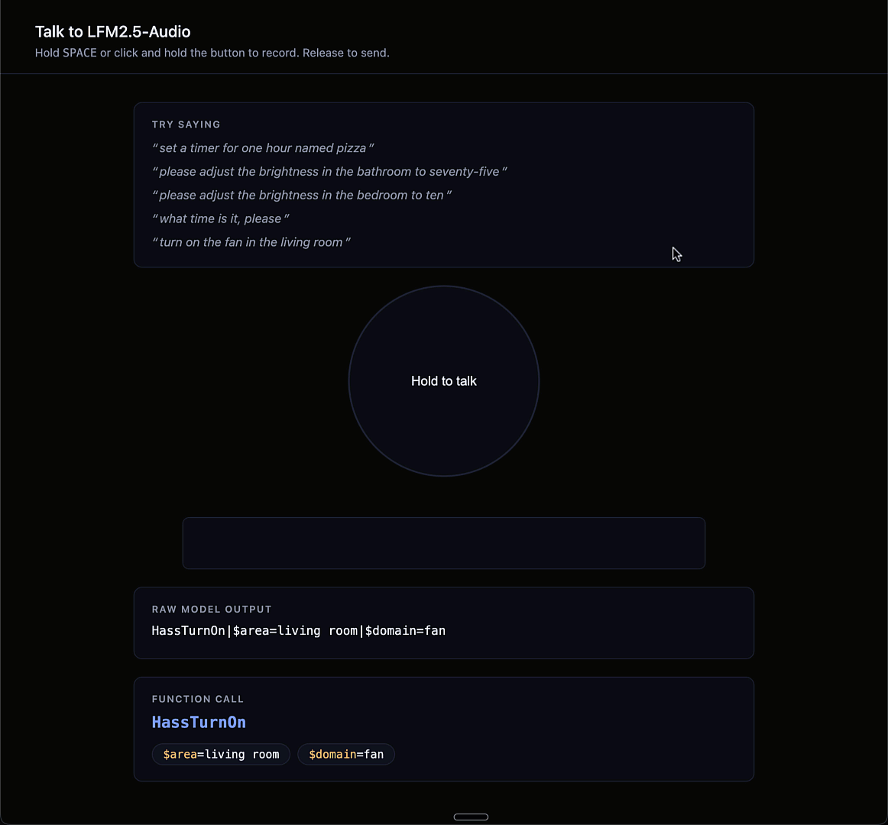
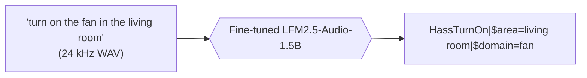
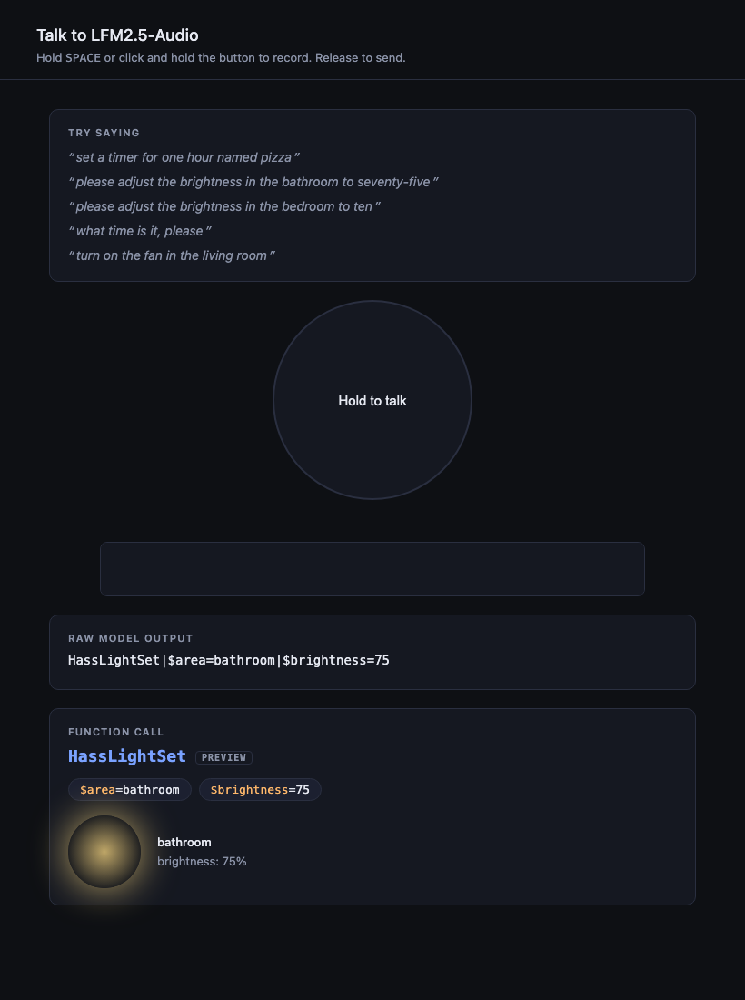
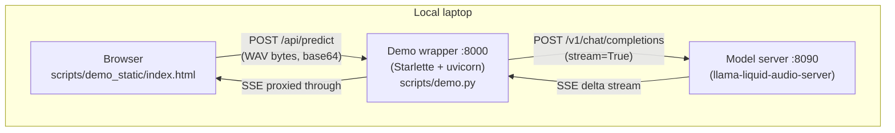

# Voice Assistant powered by a local LFM2.5-Audio

This project builds a local voice assistant that maps spoken Home Assistant
commands directly to function calls, using a fine-tuned `LFM2.5-Audio-1.5B`
running entirely on-device via llama.cpp. No cloud, no STT pipeline, no
intermediate transcription step: audio in, function call out.

<p align="center">
  
</p>



In this tutorial you will:

1. [Establish the floor](#step-1-establish-the-floor): evaluate the unmodified
   `LFM2.5-Audio-1.5B` and show that without fine-tuning it can only transcribe,
   not call functions.
2. [Preprocess and fine-tune](#step-2-preprocess-and-fine-tune) on
   [OHF-Voice](https://huggingface.co/datasets/Paulescu/OHF-Voice-audio-20260504),
   55,302 (audio, function call) pairs across 41 Home Assistant operations.
3. [Quantize and publish](#step-3-quantize-and-publish) the fine-tuned weights
   as a GGUF set that runs inside `llama-liquid-audio-server`.
4. [Evaluate the fine-tuned model](#step-4-evaluate-the-fine-tuned-model) and
   measure the gap.
5. [Talk to the model](#step-5-talk-to-the-model) in your browser via a small
   push-to-talk demo.

## Table of contents

- [Requirements](#requirements)
- [Quick start: run the published fine-tuned model](#quick-start-run-the-published-fine-tuned-model)
- [The dataset](#the-dataset)
- [The model](#the-model)
- [Step 1: Establish the floor](#step-1-establish-the-floor)
- [Step 2: Preprocess and fine-tune](#step-2-preprocess-and-fine-tune)
  - [Preprocess](#preprocess)
  - [Fine-tune](#fine-tune)
- [Step 3: Quantize and publish](#step-3-quantize-and-publish)
  - [Drain checkpoint](#drain-checkpoint)
  - [Quantize and publish](#quantize-and-publish)
- [Step 4: Evaluate the fine-tuned model](#step-4-evaluate-the-fine-tuned-model)
- [Step 5: Talk to the model](#step-5-talk-to-the-model)
- [What's next](#whats-next)

## Requirements

- [uv](https://docs.astral.sh/uv/getting-started/installation/) for the Python
  toolchain.
- An HF account + `HF_TOKEN` with write access to your username, for pushing
  the dataset/model artifacts you produce.
- A [Modal](https://modal.com) account for the fine-tuning step (~20 min on
  A100-80GB).
- For local GGUF eval / deployment: nothing extra. `scripts/eval.py` downloads
  the prebuilt `llama-liquid-audio-server` binary for your platform.
- For quantization: `git`, `cmake`, and a C++ compiler (on macOS:
  `xcode-select --install` and `brew install cmake`).

Before running any script, copy `.env.example` to `.env` and paste in your
`HF_TOKEN`:

```bash
cp .env.example .env
# then edit .env and replace hf_xxx with your token
```

Every script loads `.env` automatically. If `HF_TOKEN` is already set in your
shell (or in CI), the `.env` value will not overwrite it.

## Quick start: run the published fine-tuned model

If you just want to see the fine-tuned model in action and you don't care
about reproducing the training, run the published-checkpoint eval directly:

```bash
git clone https://github.com/Liquid4All/cookbook
cd cookbook/examples/voice-assistant
uv sync
uv run python scripts/eval.py --config configs/finetuned-q8.yaml
```

This downloads [`Paulescu/LFM2.5-Audio-1.5B-OHF-Voice-GGUF`](https://huggingface.co/Paulescu/LFM2.5-Audio-1.5B-OHF-Voice-GGUF) (the four-file
audio model + the platform runner) and evaluates it on 397 stratified samples
from the held-out test split. The snippets in this README default to Q8_0;
`configs/finetuned-f16.yaml` and `configs/finetuned-q4.yaml` ship alongside
if you want to compare quants yourself (see Step 4).

## The dataset

[`Paulescu/OHF-Voice-audio-20260504`](https://huggingface.co/datasets/Paulescu/OHF-Voice-audio-20260504)
has a deterministic 95/5 train/test split, stratified by function name, so
train and eval can never accidentally overlap.

| split | samples |
|---|---|
| train | 52,536 |
| test  | 2,766  |
| total | 55,302 |

Each row is an (audio, function call) pair. The audio is the spoken command
(WAV, 24 kHz); the function call is the model's target output. Format:

```
HassStartTimer|$minutes=5|$name=oven
HassLightSet|$area=bedroom|$brightness=70
HassGetCurrentTime
```

41 distinct function names. The four most common (Timer-related) cover ~28% of
all samples; the rarest (`HassRespond`) appears 94 times. See
[`CONTEXT.md`](./CONTEXT.md) for the full vocabulary.

## The model

[`LiquidAI/LFM2.5-Audio-1.5B`](https://huggingface.co/LiquidAI/LFM2.5-Audio-1.5B)
is a 1.5B-parameter multimodal model that consumes audio (and/or text) and
emits audio (and/or text). For this project we only use the audio-to-text
direction: spoken command in, function call text out.


*Fig. 7 from the [LFM2 technical report](https://arxiv.org/pdf/2511.23404). This project exercises only the audio-to-text path through Panel A; Panel B's audio-generation pipeline ships inside the GGUF set (vocoder is copied through in Step 3) but is not used at inference for function calling.*

Inference on-device runs through
[`llama-liquid-audio-server`](https://huggingface.co/LiquidAI/LFM2.5-Audio-1.5B-GGUF),
a custom build of llama.cpp from
[PR #18641](https://github.com/ggml-org/llama.cpp/pull/18641) that adds audio
multimodal support. Prebuilt binaries for macos-arm64, ubuntu-x64, ubuntu-arm64,
and android-arm64 ship inside the GGUF repo under `runners/`. `scripts/eval.py`
pulls the right one for your platform.

## Step 1: Establish the floor

Before fine-tuning, run the eval against the *unmodified* model to see what
the floor looks like.

```bash
uv run python scripts/eval.py --config configs/baseline.yaml
```

[`configs/baseline.yaml`](./configs/baseline.yaml) points at
`LiquidAI/LFM2.5-Audio-1.5B-GGUF` with `system_prompt: "Perform ASR."` (the
only viable audio-to-text behavioral switch the runtime exposes; see
[ADR-0001](./docs/adr/0001-eval-methodology.md) for why we don't inject
function specs into the prompt). The eval downloads ~3 GB the first time and
runs ~400 samples sequentially.

Expected result: 0% across all three layered metrics. The unmodified model is
doing plain ASR, faithfully transcribing what was said:

| metric                  | baseline result |
|---|---|
| Format compliance       | 0/397   (0.0%)  |
| Function-name accuracy  | 0/397   (0.0%)  |
| Argument accuracy       | 0/397   (0.0%)  |

```
gt:   HassBroadcast|$message=dinner is ready
pred: "Dinner is ready."
```

This is exactly what we want from the floor: no amount of prompting on this
runtime can get function-call output out of the unmodified weights. Fine-tuning
isn't an optimization, it's the only path.

## Step 2: Preprocess and fine-tune

Two stages: preprocess the train split into the on-disk tensor format the
trainer expects, then run the fine-tune on Modal.

### Preprocess

```bash
uv run --group finetune python scripts/preprocess_ohf_voice.py --modal
```

This runs `scripts/preprocess_ohf_voice.py` on a Modal A100. It reads
`Paulescu/OHF-Voice-audio-20260504` (train split only), passes each row through
`LFM2AudioProcessor`, and writes the resulting tensor dataset to the Modal
volume `ohf-voice-data` at `/output/train`. Skips any sample whose tokenised
length exceeds 512 tokens.

### Fine-tune

```bash
uv run --group finetune python scripts/train.py --modal --max-steps 1000
```

This runs `scripts/train.py` on a Modal A100-80GB. Defaults baked into the script:

| knob | value |
|---|---|
| `--context-length` | 512 |
| `--batch-size`     | 32 |
| `--max-steps`      | 10,000 (`--max-steps 1000` is enough for the reference run; see results below) |
| `--warmup-steps`   | 250 |
| `--lr`             | 5e-5 |
| `--val-split-ratio`| 0.05 (carved from train, **not** the test split) |
| `--seed`           | 42 |
| `--run-id`         | `ohf-voice-{YYYYMMDD-HHMMSS}` (per-run subfolder so re-runs never collide) |

Each invocation writes checkpoints to `/checkpoints/{run_id}/...` on the Modal
volume `lfm2-training-output`. The in-loop validation slice is carved from the
train split, never from the held-out test set, so the final eval against
`Paulescu/OHF-Voice-audio-20260504` `test` remains clean.

Both `preprocess_ohf_voice.py` and `train.py` are vendored from
`liquid-audio-staging` (`examples/audio-to-function-calling` branch, commit
`376b06a`). See [ADR-0002](./docs/adr/0002-vendoring-strategy.md) for why we
vendor instead of upstreaming.

Reference run: 1000 steps converged to train loss ~0.026, val loss ~0.023 in
~19 min on A100-80GB. The final weights live at
`/checkpoints/{run_id}/final/model.safetensors` on the `lfm2-training-output`
volume; Step 3 drains them locally and converts them to GGUF. No need to
push an intermediate safetensors HF repo.

## Step 3: Quantize and publish

To run the fine-tuned checkpoint inside `llama-liquid-audio-server` (the
thing `scripts/eval.py` uses in Step 4) we have to convert it to GGUF and
publish the resulting file set to HuggingFace.

### Drain checkpoint

Pull the fine-tuned `model.safetensors` off the Modal volume to a local
path:

```bash
modal volume get lfm2-training-output \
    /checkpoints/{run_id}/final/model.safetensors \
    outputs/checkpoint/model.safetensors
```

`{run_id}` is the timestamped folder name `scripts/train.py` printed at the
start of its run (or visible in `modal volume ls lfm2-training-output`).

### Quantize and publish

With the local checkpoint in place:

```bash
uv run --group finetune python scripts/quantize.py \
    --source-checkpoint outputs/checkpoint/model.safetensors \
    --target-repo Paulescu/LFM2.5-Audio-1.5B-OHF-Voice-GGUF \
    --quant Q8_0
```

`scripts/quantize.py`:

1. Clones llama.cpp at PR #18641 (audio multimodal support, not yet on main).
2. Overlays our `model.safetensors` on top of the upstream
   `LiquidAI/LFM2.5-Audio-1.5B` configs so `convert_hf_to_gguf.py` has the
   `config.json` / tokenizer / chat-template inputs it needs.
3. Runs `convert_hf_to_gguf.py` twice on the merged dir: once for the LM
   backbone, once with `--mmproj` for the audio encoder + projector.
4. Quantizes the LM to your target level (`--quant`) via `llama-quantize`.
   The mmproj always stays F16 (small file, no benefit to crunching it).
5. Copies the upstream `vocoder` and `tokenizer` GGUFs (these don't change
   with fine-tuning) and the `runners/` folder of prebuilt platform binaries
   from `LiquidAI/LFM2.5-Audio-1.5B-GGUF`.
6. Pushes the four GGUFs + `runners/` to your target repo with a model card.

The resulting repo is self-contained: `scripts/eval.py` in Step 4 (or any
other llama-liquid-audio-server consumer) downloads everything it needs from
one place.

The snippet above publishes Q8_0. To publish other quants alongside, rerun
with `--quant F16` and `--quant Q4_0`. Each invocation adds its own file set
(`*-F16.gguf`, `*-Q4_0.gguf`, etc.) to the same target repo; the runners and
the unchanged vocoder/tokenizer are deduped by HuggingFace's content
addressing. See Step 4 for the size/accuracy tradeoff.

## Step 4: Evaluate the fine-tuned model

Run the eval against the GGUFs you just published. Three configs ship in
this repo, one per quant:

```bash
uv run python scripts/eval.py --config configs/finetuned-q8.yaml
```

Swap `finetuned-q8.yaml` for `finetuned-f16.yaml` or `finetuned-q4.yaml` to
evaluate the other quants. Each config pins its own `quant` field and
produces its own `evals/<name>_<timestamp>/report.md` so reruns never
overwrite each other.

Same 397-sample stratified test subset as the baseline.

Reference results (2026-05-12, 1000-step fine-tune, 397 samples):

| quant | format compliance | function-name acc. | argument acc. (exact) |
|---|---|---|---|
| F16  | 99.7% | 99.0% | 90.2% |
| Q8_0 | 99.7% | 99.0% | 90.2% |
| Q4_0 | 99.0% | 98.2% | 89.7% |

All three quants land within run-to-run noise of each other (±1-3 samples
per metric on rerun, T=0). At 1.5B parameters on this task, going from F16
to Q4_0 is essentially free: the LM file shrinks from 2.3 GB to 696 MB with
no detectable drop in any of the three metrics. Pick the smallest quant
your deployment can tolerate.

The argument-accuracy gap (~90% rather than ~99%) is dominated by the model
emitting a different but plausible argument key, e.g.
`HassFanSetSpeed|$area=master bedroom|$percentage=80` when the ground truth
has `$name=master bedroom fan|$percentage=80`. Format and function-name are
effectively solved at this step count.

## Step 5: Talk to the model

The eval in Step 4 is text in, text out. To actually hear what the model does
on your own voice, run the browser demo:

```bash
uv run python scripts/demo.py --config configs/demo.yaml
```



How the pieces fit together at runtime:




This boots the same `llama-liquid-audio-server` Step 4 uses (on port 8090 by
default, so it does not collide with `eval.py`'s 8080) and serves a single
push-to-talk page from a Starlette wrapper on port 8000. A browser tab opens
automatically; hold <kbd>SPACE</kbd> or click and hold the on-screen button to
record, release to send.

The page streams the raw model output into a monospace panel as tokens arrive,
then renders a parsed card below once the stream completes. Three function
signatures get bespoke visuals: `HassLightSet` shows a bulb at the emitted
brightness, `HassStartTimer` shows a demo-speed countdown, and
`HassGetCurrentTime` shows a live clock. Anything else renders as a generic
card with the function name and `$key=value` argument pills. The bespoke
visuals are labelled "preview": the model emits a function call, the demo
visualises what the call would do, it does not bridge to a real Home Assistant.

## What's next

- Run the published GGUF on a Pi 5 or a phone via `llama-liquid-audio-cli` to
  see real on-device latency.
- Swap the dataset for your own voice commands and re-run the pipeline.
- Join the [Liquid AI Discord](https://discord.com/invite/liquid-ai) to share
  what you build.
